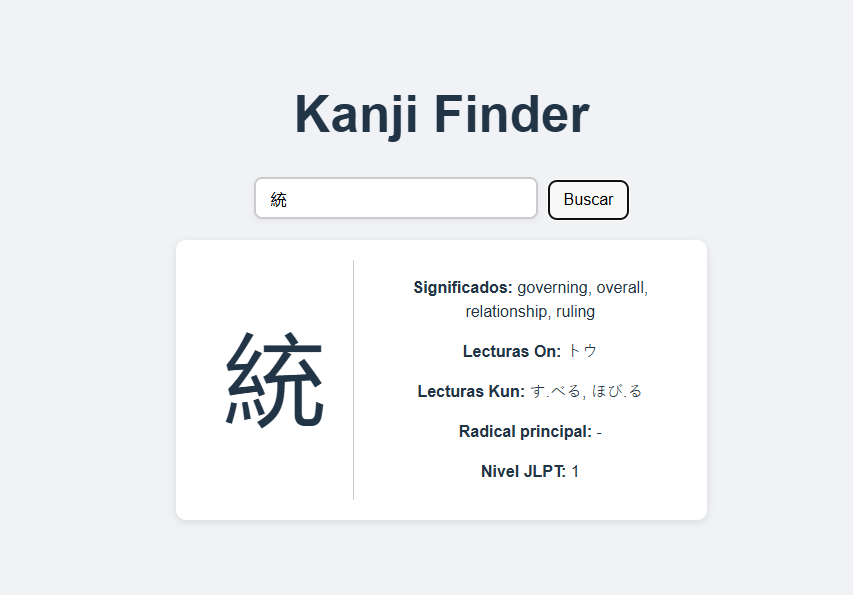

# Kanji Finder 🈶

**Kanji Finder** es una aplicación web que permite consultar información detallada sobre **un único kanji** del idioma japonés, desde niveles de dificultad **JLPT N5 a N1**. La aplicación está dividida en un frontend hecho con **React + Vite** y un backend ligero construido con **Flask**, que actúa como intermediario para consultar datos desde la API pública [kanjiapi.dev](https://kanjiapi.dev/).
## 🌐 Características

- Consulta por un solo kanji (no compuestos).
- Información basada en niveles JLPT (N5 a N1).
- Datos enriquecidos desde [kanjiapi.dev](https://kanjiapi.dev).
- Interfaz limpia y rápida, hecha con React + Vite.
- Backend simple con Flask para gestionar las peticiones.



## 🛠️ Tecnologías utilizadas

- **Frontend:** React + Vite
- **Backend:** Python + Flask
- **API:** [https://kanjiapi.dev](https://kanjiapi.dev)
- **Estilos:** CSS

## 🔌 API utilizada

Este proyecto consume los datos desde:

```
https://kanjiapi.dev/v1/kanji/all
```

Por ejemplo, para consultar el kanji 日:

```
https://kanjiapi.dev/v1/kanji/日
```

La respuesta incluye lecturas on'yomi, kun'yomi, significado, número de trazos, y nivel JLPT.

## 🚀 Instalación

### 1. Clona el repositorio

```bash
git clone https://github.com/mvgarc/Kanji_Finder.git
cd Kanji_Finder
```

---

### 2. Backend (Flask)

```bash
cd backend
python -m venv venv
source venv/bin/activate  # En Windows: venv\Scripts\activate
pip install -r requirements.txt
flask run
```

Por defecto corre en: `http://localhost:5000`

---

### 3. Frontend (React + Vite)

```bash
cd ../frontend
npm install
npm run dev
```

Accede desde `http://localhost:5173`

---

## 🔮 Mejoras futuras

- Búsqueda por lectura o significado.
- Ejercicios interactivos para practicar kanjis.
- Historial de kanjis consultados.
- Modo oscuro.

## 🤝 Contribuciones

¿Tienes ideas o quieres mejorar la app? ¡Los pull requests y sugerencias son bienvenidos!

## 📄 Licencia

Este proyecto está bajo la licencia MIT. Revisa el archivo `LICENSE` para más detalles.


Desarrollado con 💻 por [@mvgarc](https://github.com/mvgarc)
